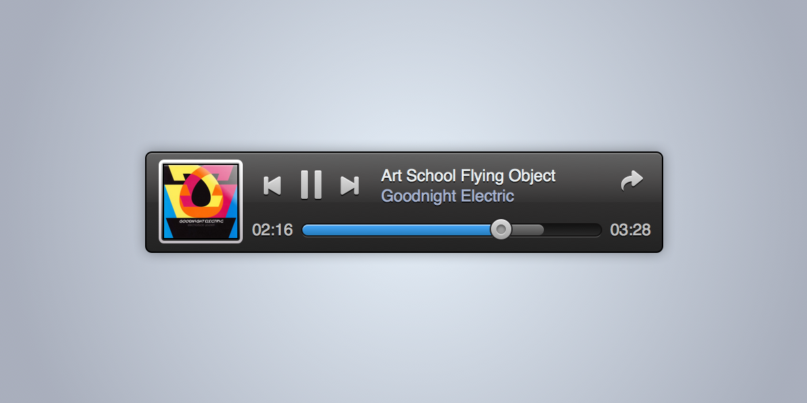

# Challenge #

The idea is to create a simple music player. It is expected the music player has a limited set of music files (`music` folder) and offers play/pause/next/previous track functionality. It should also offer to seek through the current playing track using a slider. The size of the UI is defined based on the background image.

You should create a git repository on bitbucket (https://bitbucket.org/), where all necessary graphics and fonts (you should use the font provided OpenSans-Regular), as also music files and covers will be uploaded.

What do we expect:

* clean, thoughtful code
* clean, frequent commits
* You use QtCreator from Qt5
* comments which explains the code from your perspective
* beautiful user interface (does not have to be exact)
* components (e.g. Tool to click an icon and Slider to seek the music)
* some animations (e.g. when an icon is pressed it should get a little bit smaller)
* a suggestion for an extension (what else could the music player do, and how)
* only QML/JS code, no C++ code
* QtQuick.Controls module should not be used. The idea is to create your own components
* the slider might be the most difficult part, so ensure it’s well structured.

Things one should look at:

* git :-) (http://git-scm.com/documentation)
* Qt5 (http://qt-project.org/downloads)
* ListModel/Item/Rectangle/Image/BorderImage/Behavior/NumberAnimation/Audio/FontLoader from Qt Quick (aka QML), see Qt Documentation

Note: Maybe you also want to check out SourceTree, which is a GUI client for GIT.

To play audio you can use the QtMultimedia module (http://qmlbook.org/ch10/index.html#playing-media, http://qt-project.org/doc/qt-5/qml-qtmultimedia-audio.html)

I took the example from http://www.sketchappsources.com/free-source/244-music-player-widget.html, just for your background information.
